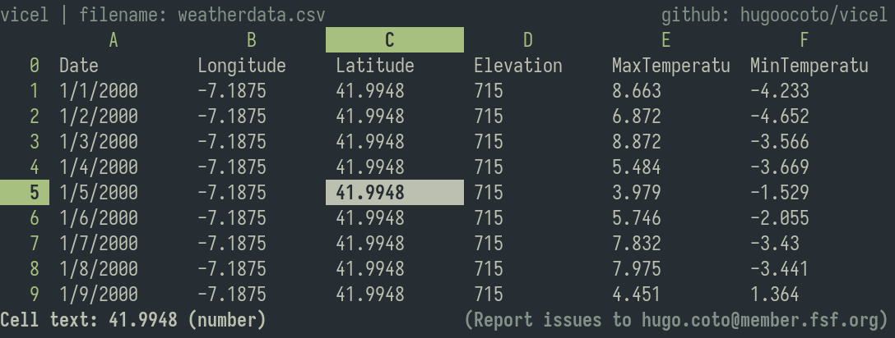
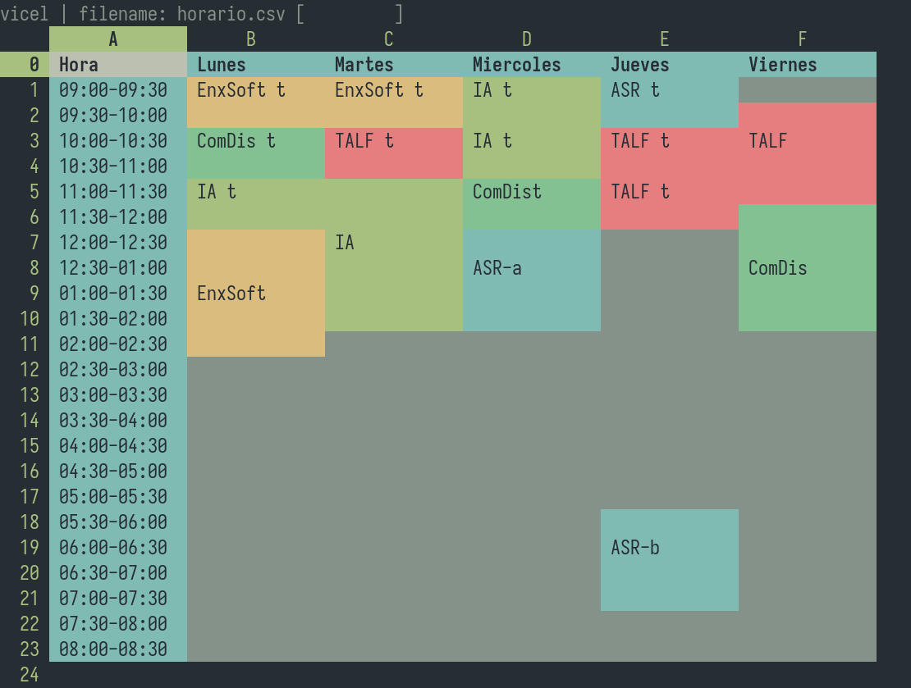

# Visual Cell Editor
Vicel is a free open source TUI spreadsheet editor. You can read, modify and
save data stored in rows and columns. It aims to be an alternative to
proprietary non gratis well known Microsoft program, for non professional usage.

Webpage: https://hugoocoto.github.io/vicel/



## Features
* Edit CSV-like grids interactively in your terminal
* Supports numbers, text, and formulas
* Keyboard-focused Vim-style motions
* Lightweight and minimal code
* Configuration via .py file
* Mouse support

## Reference manual 
Documentation and installation/usage guide are
[here](./docs/vicel_reference.pdf). [Download link](https://raw.githubusercontent.com/hugoocoto/vicel/main/docs/vicel_reference.pdf)

## How to host vicel in the browser
You can use `ttyd` to host a pty in the browser. Using the following command you
would have vicel running in http://localhost:08080.
```sh 
ttyd --force-tty -p 8080 -W "vicel" 
```

## Latest Version
[See version](./version.txt)

## Lines of Code
[Lines written](./wc.md) A little reflection: the fewer the lines, the better.
I like to flex on how little code is needed for a fully functional program.

## Status
> It’s **kinda usable** for now.


## Sheets done by the community
* *Horario* by @hugoocoto 

