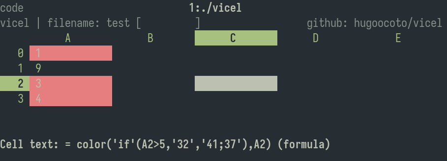

# Visual Cell Editor
A terminal-based cell editor for visual spreadsheets. Create, read, and write
cells interactively.


## Features
* Edit CSV-like grids interactively in your terminal
* Supports numbers, text, and formulas
* Keyboard-focused Vim-style motions
* Lightweight and minimal code

## Installation
You can install **Visual Cell Editor** by running:

```bash 
make install  # installs to ~/.local/bin 
```
Or just build locally with:
```bash 
make 
```
> All sources are in the `src/` folder. You can also compile manually using
> any C compiler.

## Touchpad support
If your terminal emulator send arrow movement on touchpad actions it can be
used. It is not intended but it works for me (tmux + alacritty).

## Usage
Run from the terminal:
```bash 
vicel data.csv 
```
The first non-flag argument is used as the filename.

### Options
| Flag                | Description          | 
| ------------------- | -------------------- | 
| `-m`, `--use-mouse` | Enable mouse support |
| `-D`, `--debug`     | Enable debug output  |

## Mappings
> *As of the time of writing*

### Movement
* `h`, `l`, `j`, `k`: Move cursor left, right, down, up
* `$`: Go to last cell of the current row
* `^`: Go to first cell of the current row
* `gg`: Go to first cell of the current column
* `G`: Go to last cell of the current column
* `g0`: Same as `gg` and `^`

### Editing
* `i`: Input/edit current cell
* `d`: Delete cell (set as empty)
* `v`: Toggle cell selection (useless)

### Insert + move
* `gij`, `gik`, `gih`, `gil`: Insert input and move in the given direction

### Add/delete rows/columns
* `gj`: Add a new row after the cursor
* `gl`: Add a new column after the cursor
* `gk`: Add a new row before the cursor
* `gh`: Add a new column before the cursor
* `gJ`: Add a new row at the end 
* `gL`: Add a new column at the end
* `gK`: Add a new row at the start 
* `gH`: Add a new column at the start
* `gdj`: Delete row and move up
* `gdl`: Delete column and move right
* `gdk`: Delete row and move down
* `gdh`: Delete column and move left

### Expand cells
* `J`, `K`, `H`, `L`: Expand current cell down, up, left, right (and move)

### Misc
* `q`: Quit
* `w`: Write
* `y`: Yank (copy)
* `p`: Paste 
* `r`: Re-render the screen

## Input Format
Press `i` while the cursor is on a cell.
Supported formats:
* **Numbers**: Decimal numbers like `-10`, `3.14`
* **Text**: Any non-number string
* **Formula**: Starts with `=`, e.g. `=C2 + 8.5`

>  Cell references are of the form `A1`, `B3`, etc.

## Builtin functions
Builtin functions can be called in formulas. It take numbers, text or cells as 
arguments and return a value. 
* **sum(...)**: Sum zero or more arguments and return the result as if adding it
  one by one.
* **mul(...)**: Multiply zero or more arguments. 
* **avg(...)**: Get the average of zero or more values. 
* **count(...)**: Get the number of non empty arguments.
* **min(...)**: Get the min number between arguments.
* **max(...)**: Get the max number between arguments.
* **if(cond, iftrue [, else])**: Get the value depending on the condition.
* **color(color, cells [, ...])**: Apply color to one or more cells
* **colorb(color, cells [, ...])**: Apply color if not done yet to one or more
  cells
* **literal(v)**: Evaluates to v, literally. Can be used to store numbers as
  strings.

> Functions accept ranges as parameters. They are two valid cells separated by
> a `:`. For example, `sum(A0:A9)` is the same as sum the 10 first numbers in
> row `A`.

### Weirdest Color setter
There is a builtin function called **color()** that changes the color of a cell.
It can be used as: **color(color, cell [, cell]\* )**. Color can be a number, as
ascii colors work: 30-37 for fg and 40-47 for bg to summarize. Also it can be
set to more than one if using the formula string introducer, `'` as follow:
**'35;42;1'** for magenta bold text in green background. Also, there is another
function **colorb** that only changes the color if using the default. It is useful
for set a bg color that can be override by other color calls. 
    


## Latest Version
[See version](./version.txt)

## Lines of Code
[Lines written](./wc.md) A little reflection: the fewer the lines, the better.
I like to flex on how little code is needed for a fully functional program.

## Status
> It’s **kinda usable** for now.


## Known issues
Issues [here](./TODO_ISSUES.md).

## Sheets done by the community
* *Horario* by @hugoocoto 
