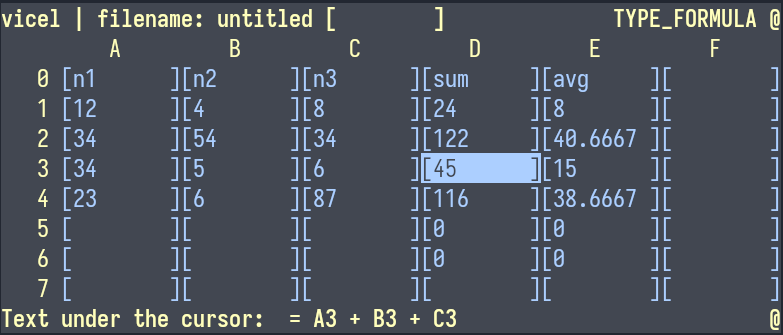

# Visual Cell Editor
A terminal-based cell editor for visual spreadsheets. Create, read, and write
cells interactively.


## Features
* Edit CSV-like grids interactively in your terminal
* Supports numbers, text, and formulas
* Keyboard-focused — Vim-style motions
* Optional mouse support
* Lightweight and minimal code

## Installation
You can install **Visual Cell Editor** by running:

```bash 
make install  # installs to ~/.local/bin 
```
Or just build locally with:
```bash 
make 
```
> All sources are in the `src/` folder. You can also compile manually using
> any C compiler.

## Usage
Run from the terminal:
```bash 
vicel data.csv 
```
The first non-flag argument is used as the filename.

### Options
| Flag                | Description          | 
| ------------------- | -------------------- | 
| `-m`, `--use-mouse` | Enable mouse support |

## Mappings
> *As of the time of writing*

### Movement
* `h`, `l`, `j`, `k`: Move cursor left, right, down, up
* `$`: Go to last cell of the current row
* `^`: Go to first cell of the current row
* `gg`: Go to first cell of the current column
* `G`: Go to last cell of the current column
* `g0`: Same as `gg` and `^`

### Editing
* `i`: Input/edit current cell
* `d`: Delete cell (set as empty)
* `v`: Toggle cell selection (useless)

### Insert + move
* `gij`, `gik`, `gih`, `gil`: Insert input and move in the given direction

### Add rows/columns
* `gj`: Add a new row
* `gl`: Add a new column

### Expand cells
* `J`, `K`, `H`, `L`: Expand current cell down, up, left, right (and move)

### Misc
* `q`: Quit
* `r`: Re-render the screen

## Input Format
Press `i` while the cursor is on a cell.
Supported formats:
* **Numbers**: Decimal numbers like `10`, `3.14`
* **Text**: Any non-number string
* **Formula**: Starts with `=`, e.g. `=C2 + 8.5`

>  Cell references are of the form `A1`, `B3`, etc.

## Builtin functions
Builtin functions can be called in formulas. It take numbers, text or cells as 
arguments and return a value. 
* **sum(...) -> v**: Sum zero or more arguments and return the result as sum it
  using the sum operator.

## Latest Version
[See version](./version.txt)

## Lines of Code
[Lines written](./wc.md) A little reflection: the fewer the lines, the better.
I like to flex on how little code is needed for a fully functional program.

## Status
> It’s **kinda usable** for now.


